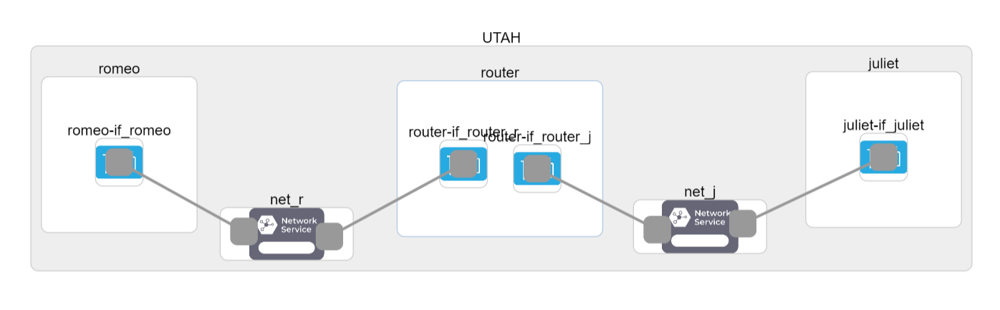
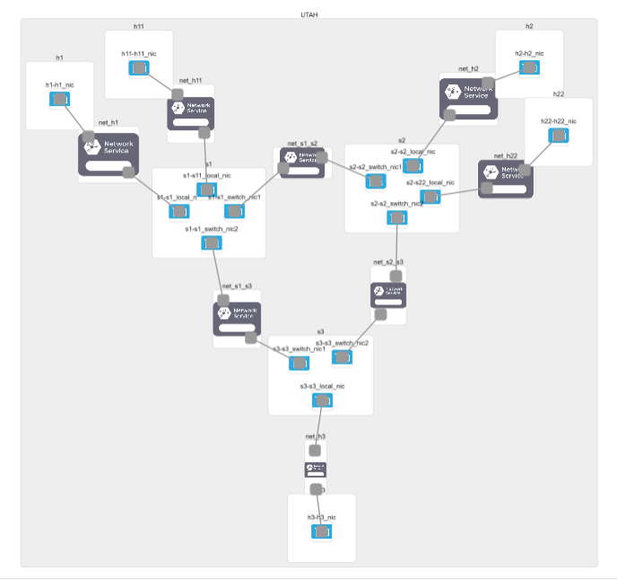

# Enhanced ECN Implementation

### Introduction

This projects covers the implementation of enhanced ECN using P4 programming. 

Explicit congestion notification (ECN) is a feature that allows routers
to explicitly signal to a TCP sender when there is congestion. 
This allows the sender to reduce its congestion window before the
router is forced to drop packets, reducing retransmissions. 
It can also help the router maintain a minimal queue, 
which reduces queuing delay.

However, this implies that we explicitly rely on the receiver 
to inform the sender about the congestion,
which introduces an additional delay in the congestion control. 
This project wants to experiment with an idea where we do not fully 
rely on the receiver to inform the sender. 

The proposed idea is to intercept the ACK segments from 
the receiver and set the ECN-echo bit of the packet 
in network transit whenever the congestion is detected. 
However, TCP-based routers can't modify the headers of the 
packet in transit being an end-to-end protocol. 
That's why P4-based routers are proposed to accomplish this idea. 
P4 programming (based on Software Defined Networking) allows 
the routers to add or modify the packet headers in transit. 
The router itself can detect early congestion for ECN-enabled 
traffic and modify the ECN-echo bit of the incoming ACK packet.

The motivation for this idea comes from the [paper](https://ieeexplore.ieee.org/document/9058340/)

### Topology
We use the following topology for our experiment:

Steps to invoke congestion in the network:
- send a low rate traffic from h1 to h2
- send a high rate iperf traffic from h11 to h22
- The link (bandwidth: 512 Kbps) between s1 and s2 serves as a bottleneck in the network.

### Implementation
ecn.p4 contains the main implementation of the enhanced ECN approach.
The default parameters for this experiment are taken from [P4lang Tutorial](https://github.com/p4lang/tutorials/tree/master/exercises/ecn) 

The above-mentioned tutorial uses UDP for testing ECN over the Topology.
Hence, we have modified send.py and receive.py to test the topology over TCP.
In addition, we have implemented the code to calculate RTT for the experiment.

### Mininet Deployment

### FABRIC Files
[jiabhi_tcp.ipynb] tests the TCP default congestion control (AIMD) for the Romeo-Juliet . 
 This can simply be uploaded on the FABRIC and executed. The notebook covers installing end-to-end dependencies on the network nodes.

[jiabhi_tcp_ecn.ipynb] tests the ECN based TCP congestion control for the Romeo-Juliet . 
 This can simply be uploaded on the FABRIC and executed. The notebook covers installing end-to-end dependencies on the network nodes.

[jiabhi_tcp_ecn.ipynb] tests the ECN based TCP congestion control for the Complex Topology used for this experiment . 
 This can simply be uploaded on the FABRIC and executed. The notebook covers installing end-to-end dependencies on the network nodes.

[jiabhi_complex_p4_ecn.ipynb] tests the Enhanced ECN (over P4) based TCP congestion control for the Complex Topology used for this experiment . 
 This notebook is not complete and requires changes for successful deployment on FABRIC.
This is work in progress.

Mininet Setup:
The following steps need to be followed to install Mininet:
- Create an EC2 instance of type t2.large (2 vCPU and 8GB memory) with a 20GB Elastic Block Store (EBS) hard disk and Ubuntu 18.04 as OS.
- Create a session in PuTTY with the instance's IP address and under SSH -> Auth -> X11 check Enable X11 forwarding.
- Add your private key file to Paegant and log in to the instance.
- Run sudo apt-get update.
- Run sudo apt-get install mininet.
- Verify mininet installation using mn --version.
